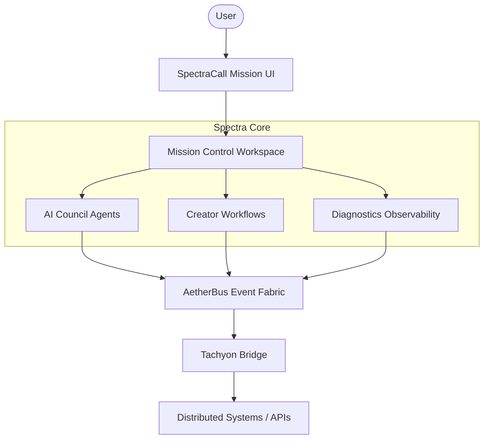

# SpectraCall | AI-Assisted Mission Control

[](https://nextjs.org/)
[](https://www.typescriptlang.org/)
[](https://react.dev/)
[](https://tailwindcss.com/)
[](https://opensource.org/licenses/MIT)

SpectraCall is an AI-assisted Mission Control platform designed for monitoring systems, coordinating intelligent agents, and orchestrating operational workflows from a unified command interface.

It combines real-time system observability, AI-powered decision support, operational workflows, and event orchestration into a single, high-performance mission control environment.

---

## 🚀 Overview

SpectraCall acts as the control layer of the Spectra platform, providing a visual interface for interacting with AI agents, operational workflows, distributed systems, and event pipelines.

The platform is designed for high-complexity decision environments:
- **Distributed Systems:** Real-time monitoring and management.
- **Automated Operations:** Coordinated agent actions and deployment pipelines.
- **Infrastructure Monitoring:** Deep signal analysis and alerting.
- **AI Governance:** Human-in-the-loop approval for AI-generated recommendations.

---

## 🖥️ Mission Control UI

The SpectraCall interface functions as a professional-grade Mission Control Dashboard.

### Primary Entry Points
*   **`/overview`**: **System Summary Dashboard.** High-level view of system health, operational metrics, active alerts, and recent events.
*   **`/workspace`**: **Operational Control Panel.** Deep-dive interface for executing actions, approving workflows, inspecting system topology, and reviewing AI recommendations.

### Key Features
*   **Mission Control Dashboard:** A unified interface for monitoring system health and operational signals.
*   **Approval Workflow:** Built-in system for inspecting, approving, or rejecting operational actions and system changes.
*   **AI Recommendations:** Intelligent suggestions for performance optimization, risk mitigation, and automated deployments.
*   **Real-Time Timeline:** Audit-ready event tracking for deployments, system changes, alerts, and AI activity.

---

## 🏗️ Platform Architecture

### Detailed Architecture Documentation
For more in-depth technical specifications, please refer to the following documentation:

- [AetherBus + Tachyon Architecture](docs/architecture/aetherbus-tachyon.md)
- [Envelope Specification](docs/architecture/envelope-spec.md)
- [Agent Registry](docs/architecture/agent-registry.md)
- [Execution Maps](docs/architecture/execution-map.md)
- [Governed Fine-tuning in ASI](docs/governed-fine-tuning-asi.md)


SpectraCall is the frontend of the broader Spectra Mission Control Platform, built on a high-throughput, three-tier performance model.

### Three-Tier Performance Model
1.  **The Silicon Fabric (Level 1):** Physical & Kernel Layer using RDMA/RoCE v2 and Zero-Copy Networking. (Latency < 5µs)
2.  **The Tachyon Bridge (Level 2):** FFI & Memory Layer (Rust + PyO3) with Zero-Copy Pointer Passing. (Latency < 50µs)
3.  **The Cognitive Plane (Level 3):** Event Loop Layer (Python asyncio + uvloop) for high-level orchestration and LLM integration. (Latency < 1ms)

### System Topology


### HFT Optimizations
*   **Local Variable Caching:** Eliminates "Dot Lookup" overhead for method calls.
*   **Slot-Based Optimization:** Fixed-size memory allocation via `__slots__` for massive agent swarms.
*   **Atomic ID Generation:** 150X speedup using `itertools.count()` over standard UUIDs.
*   **Python Dispatch:** Optimized to 600,000+ msg/s on standard hardware.

---

## 🧩 Platform Modules

| Module | Purpose |
| :--- | :--- |
| **`overview`** | System-wide summary and health dashboard. |
| **`workspace`** | Mission control operational panel and action center. |
| **`council`** | Governance layer for AI decision-making agents. |
| **`creator`** | Workflow builder for automated operational sequences. |
| **`diagnostics`** | System analysis and observability engine. |
| **`executive`** | High-level AI command interface (Chat/Live/Strategy). |

---

## 📂 Project Structure

```text
src
 ├─ app                     # Next.js App Router (Routes & Pages)
 │   ├─ overview/           # Primary Dashboard
 │   ├─ workspace/          # Mission Control Panel
 │   ├─ council/            # AI Agent Governance
 │   ├─ creator/            # Workflow Orchestration
 │   ├─ diagnostics/        # System Analysis
 │   └─ executive/          # Command Suite
 ├─ components              # Shared & Module Components
 │   ├─ workspace/          # Workspace-specific UI
 │   ├─ dashboard/          # Dashboard Widgets
 │   └─ ui/                 # Reusable Radix UI components
 ├─ ai                      # Genkit AI Flows & Configuration
 ├─ hooks                   # Custom React Hooks (e.g., use-toast)
 ├─ lib                     # Utilities, Schemas & Mock Data
 └─ styles                  # Global CSS & Tailwind Config
```

---

## ⚡ Quick Start

### 1. Clone & Install
```bash
git clone https://github.com/lnspirafirmaGPK/SpectraCall.git
cd SpectraCall
npm install
```

### 2. Run Development Server
```bash
npm run dev
```
Open [http://localhost:3000](http://localhost:3000) to view the dashboard.

### 3. Build for Production
```bash
npm run build
npm start
```

---

## 🐳 Docker Support

SpectraCall can be containerized for consistent deployment.

```bash
# Build the image
docker build -t spectracall .

# Run the container
docker run -p 3000:3000 spectracall
```

---

## 📡 Backend Services

### FastAPI Governance API
Located in `/fastapi_app`. Provides internal architecture metadata, capacity estimation, and latency budget evaluation.
*   **Key Endpoints:** `GET /v1/internal/architecture`, `POST /v1/internal/latency-evaluation`.

### Go API Service
Located in `/go_api`. High-performance service handling alerts, freeze-actions, and compliance approvals.
*   **Port:** `8080` (with OIDC production hardening).

---

## 🔧 Troubleshooting

*   **Ngrok Tunnel Timeout:** Restart the tunnel and ensure the local server is running before sharing the URL.
*   **Streaming Issues:** Ensure your proxy/load balancer supports Server-Sent Events (SSE) and has buffering disabled.
*   **Port Conflicts:** Use `PORT=4000 npm run dev` if 3000 is occupied.

---

## 🗺️ Roadmap
- [ ] Distributed agent orchestration across multi-region clusters.
- [ ] Automated decision workflows with MCTS reasoning traces.
- [x] System replay engine for operational auditing.
- [ ] Replay retention policies with configurable evidence TTL and legal-hold support.

---

## 📄 License
This project is licensed under the **MIT License**.

## 🤝 Acknowledgments
SpectraCall is part of the **Spectra Mission Control Platform** designed for Aetherium-Syndicate-Inspectra (ASI) Protocol.

---

## Mission Control principles
- SpectraCall is the **Mission Control UI/Control Surface** for operators and approvals.
- Mission Control coordinates actions across Control, Data, Trust, Governance, and Observability planes.
- Privileged execution requires envelope integrity, policy checks, and auditable lineage.
- UI surfaces evidence and context, but execution authority remains policy + approval driven.

## 5-plane architecture
- **Control Plane:** operator actions, approvals, interventions, freeze and replay triggers.
- **Data Plane:** workflow workers, domain execution, and embedding generation.
- **Trust Plane:** identity, signatures, lineage verification, and replay integrity.
- **Governance Plane:** policy evaluation, risk scoring, obligations, and exception control.
- **Observability Plane:** traces, logs, metrics, and forensic audit trails.

## Evidence/context layer
- Multimodal embeddings are generated in Data Plane workers (not browser clients).
- Embedding output is consumed as context/evidence for decisions, not as standalone authority.
- Evidence artifacts are linked to envelope IDs, policy scopes, and lineage hashes.

## Budget Reallocation slice
Budget Reallocation is the minimum viable end-to-end slice because it includes:
1. Proposal event generation
2. Policy evaluation and risk scoring
3. Human approval workflow
4. Execution and result publication
5. Replay and lineage-ready audit artifacts


## Budget Reallocation demo runbook
1. Run SpectraCall frontend (Mission Control):
   - `cd frontend && npm run dev`
2. Run embedding worker (separate terminal):
   - `cd services/embedding-worker && pip install -r requirements.txt && uvicorn app.main:app --host 0.0.0.0 --port 8001`
3. Optional env for connected mode:
   - `export EMBEDDING_WORKER_URL=http://localhost:8001`
   - `export GEMINI_API_KEY=<optional>`
4. Open `http://localhost:9002/workspace/budget-reallocation`.
5. In Mission Control, add evidence and click **Run decision pipeline**.
6. Verify panels execute end-to-end:
   - Evidence intake -> embedding/context prep -> context retrieval -> policy proposal -> human approve/reject -> replay/lineage.
7. Degraded mode demo:
   - Stop worker or unset `EMBEDDING_WORKER_URL`; flow still runs with fallback context and `degraded mode` state.

## Coding standards for contracts, tracing, errors, and policy
- **Contracts:** Use strict TypeScript interfaces under `frontend/src/lib/types` and evolve additively.
- **Tracing:** Require `traceparent` in envelope contracts and preserve `tracestate` when present.
- **Errors:** Return RFC7807 Problem Details with extension fields where helpful.
- **Policy:** Every mutable action must include explicit `policy_scope` and a recorded `PolicyCheck`.
- **Lineage/Replay:** Include lineage hashes and replay references for control-impacting events.
