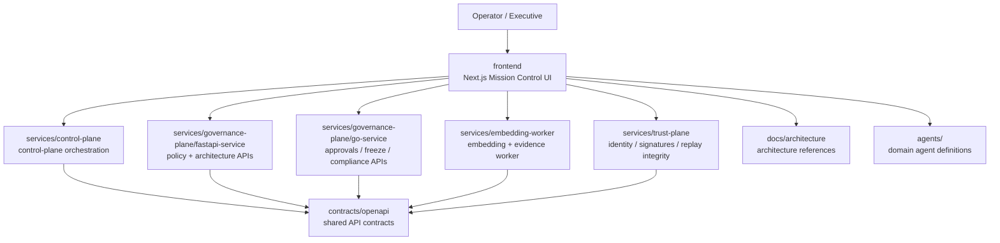
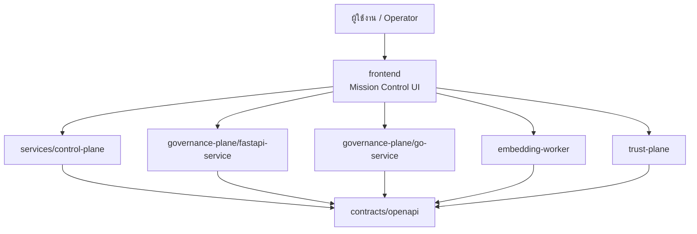

# SpectraCall | AI-Assisted Mission Control

[](https://nextjs.org/)
[](https://www.typescriptlang.org/)
[](https://react.dev/)
[](https://tailwindcss.com/)
[](https://opensource.org/licenses/MIT)

SpectraCall is the operator-facing mission control surface for the Spectra platform. It brings together approvals, governed AI workflows, evidence-aware decisions, infrastructure visibility, and replay-friendly audit trails inside one unified Next.js application.

---

## English

### What SpectraCall is for

SpectraCall is designed for high-complexity operational environments where humans and AI systems must collaborate safely:

- **Mission Control UI:** a single launchpad for system health, alerts, and high-priority operator actions.
- **Governed Workflows:** policy-aware actions with approval checkpoints, lineage, and replay readiness.
- **Evidence-Aware Operations:** contextual embeddings and supporting artifacts can enrich decisions without becoming the sole authority.
- **Cross-Plane Visibility:** operators can move between Control, Data, Trust, Governance, and Observability concerns from one interface.

### Core application surfaces

| Route | Purpose |
| :--- | :--- |
| `/` | New landing page that explains architecture, system planes, and route entry points. |
| `/overview` | System summary dashboard for KPIs, decisions, infrastructure health, and agent status. |
| `/workspace` | Mission Control workspace for approvals, alerts, recommendations, and operational actions. |
| `/workspace/budget-reallocation` | End-to-end budget reallocation scenario with evidence, policy, and replay lineage. |
| `/workspace/control-plane/services` | Service catalog for cross-plane ownership, contracts, and event dependencies. |
| `/infrastructure` | Topology and runtime transport visibility. |
| `/accounting` | Finance-focused workflows, decision artifacts, and accounting agent collaboration. |

### System architecture

SpectraCall is best understood as the Control Plane user experience that coordinates several backend capabilities stored in this repository.

#### Repository architecture diagram



#### Platform plane mapping

| Plane | Main repository areas | Responsibility |
| :--- | :--- | :--- |
| **Control Plane** | `frontend/`, `services/control-plane/` | Operator actions, approvals, mission workflows, and UI orchestration. |
| **Data Plane** | `services/embedding-worker/` | Embeddings, evidence preparation, and contextual artifact generation. |
| **Trust Plane** | `services/trust-plane/` | Identity, signatures, lineage integrity, and replay trust guarantees. |
| **Governance Plane** | `services/governance-plane/fastapi-service/`, `services/governance-plane/go-service/` | Policy evaluation, approvals, compliance, freeze actions, and risk handling. |
| **Contracts & Shared Semantics** | `contracts/openapi/`, `frontend/src/lib/types/` | Shared schemas, API contracts, and typed application boundaries. |
| **Architecture Knowledge** | `docs/architecture/`, `docs/governance/` | Reference docs, specifications, and operational design context. |

### Project structure

```text
SpectraCall/
├─ frontend/                    # Next.js application and Mission Control UI
│  ├─ src/app/                  # App Router pages and route segments
│  ├─ src/components/           # Shared UI, dashboard, and workspace components
│  ├─ src/lib/                  # Types, mocks, utilities, server helpers
│  └─ src/ai/                   # Genkit flows and AI orchestration
├─ services/
│  ├─ control-plane/            # Control-plane backend logic
│  ├─ embedding-worker/         # Evidence + embedding worker
│  ├─ governance-plane/
│  │  ├─ fastapi-service/       # Python governance APIs
│  │  └─ go-service/            # Go governance/compliance APIs
│  └─ trust-plane/              # Trust and verification services
├─ contracts/openapi/           # Shared OpenAPI contracts
├─ docs/                        # Architecture and governance documentation
├─ agents/                      # Agent/domain definitions
└─ infrastructure/              # Terraform and Kubernetes manifests
```

### Local development

#### Frontend

```bash
cd frontend
npm install
npm run dev
```

The frontend runs on **http://localhost:9002** in development.

#### Production build

```bash
cd frontend
npm run build
npm run start
```

### Services in this repository

| Service | Path | Notes |
| :--- | :--- | :--- |
| Embedding Worker | `services/embedding-worker/` | Generates embeddings and evidence artifacts for context enrichment. |
| Governance FastAPI Service | `services/governance-plane/fastapi-service/` | Internal governance, architecture, and policy-related APIs. |
| Governance Go Service | `services/governance-plane/go-service/` | High-performance approvals, freeze actions, and compliance endpoints. |
| Trust Plane | `services/trust-plane/` | Trust, replay, and verification-oriented capabilities. |

### Mission Control principles

- SpectraCall is the **Mission Control UI / control surface** for operators and approvals.
- UI actions should remain **policy-scoped, lineage-aware, and replay-friendly**.
- Evidence artifacts support decisions but do not replace human or policy authority.
- Control-impacting actions should preserve **trace context**, **policy scope**, and **auditability**.

### Roadmap ideas

#### English feature proposals

- Add a real-time route status board sourced from service health and OpenAPI contract validation.
- Introduce a cross-plane dependency explorer that links UI routes to contracts, events, and owners.
- Add evidence quality scoring so operators can compare strong vs. degraded context before approval.
- Build a replay drill mode that simulates control-plane incidents with guided remediation steps.
- Add contract drift detection between `contracts/openapi/` and frontend/server action consumers.

---

## ภาษาไทย

### SpectraCall คืออะไร

SpectraCall คือหน้าจอ Mission Control สำหรับผู้ปฏิบัติการของแพลตฟอร์ม Spectra โดยรวมงานอนุมัติ เวิร์กโฟลว์ AI แบบมี governance ข้อมูลประกอบการตัดสินใจ การมองเห็นสถานะโครงสร้างระบบ และเส้นทาง audit/replay ไว้ในแอปเดียว

### พื้นที่ใช้งานหลักของระบบ

| เส้นทาง | หน้าที่ |
| :--- | :--- |
| `/` | หน้าแรกใหม่สำหรับอธิบายภาพรวมสถาปัตยกรรม plane ของระบบ และทางลัดเข้าสู่แต่ละส่วน |
| `/overview` | Dashboard สรุป KPI, การตัดสินใจสำคัญ, สถานะ infrastructure และ agent |
| `/workspace` | พื้นที่ Mission Control สำหรับ approvals, alerts, recommendations และการสั่งงานหลัก |
| `/workspace/budget-reallocation` | ตัวอย่าง flow ครบวงจรที่เชื่อม evidence, policy, approval และ replay lineage |
| `/workspace/control-plane/services` | Service catalog สำหรับดู owner, contract และ event dependency ข้าม plane |
| `/infrastructure` | มุมมอง topology, transport และสุขภาพของ node |
| `/accounting` | พื้นที่งานบัญชี การร่วมงานกับ agent และตรวจสอบ decision artifact |

### แผนภาพสถาปัตยกรรมระบบ



### การจับคู่กับโครงสร้างของ repository

| ส่วน | โฟลเดอร์หลัก | บทบาท |
| :--- | :--- | :--- |
| Control Plane | `frontend/`, `services/control-plane/` | หน้าจอผู้ใช้ การสั่งงาน การอนุมัติ และ orchestration |
| Data Plane | `services/embedding-worker/` | สร้าง embedding และจัดเตรียม evidence/context |
| Trust Plane | `services/trust-plane/` | ความน่าเชื่อถือ ลายเซ็น lineage และ replay integrity |
| Governance Plane | `services/governance-plane/fastapi-service/`, `services/governance-plane/go-service/` | policy, risk, compliance, approvals และ freeze control |
| Shared Contracts | `contracts/openapi/`, `frontend/src/lib/types/` | สัญญาข้อมูลและ schema ระหว่างระบบ |
| Documentation | `docs/architecture/`, `docs/governance/` | เอกสารอธิบายสถาปัตยกรรมและ governance |

### การเริ่มต้นใช้งานแบบ local

```bash
cd frontend
npm install
npm run dev
```

หน้า frontend สำหรับพัฒนาใช้งานที่ **http://localhost:9002**

### แนวทางต่อยอดใหม่

#### รายการข้อเสนอฟังก์ชัน

- เพิ่มหน้า dependency map ที่เชื่อม route ใน UI กับ service, event และ owner จริงของแต่ละ plane
- เพิ่ม health signal จาก service จริงเพื่อให้หน้า landing และ workspace แสดงสถานะสดแทน mock data
- เพิ่มการเปรียบเทียบคุณภาพของ evidence/context ก่อนอนุมัติ เพื่อช่วยตัดสินใจใน degraded mode
- เพิ่ม replay simulation mode สำหรับซ้อม incident และบันทึกผลการตัดสินใจย้อนหลัง
- เพิ่มตัวตรวจจับ contract drift ระหว่างไฟล์ OpenAPI กับ consumer ฝั่ง frontend/server actions

---

## Reference documents

- [AetherBus + Tachyon Architecture](docs/architecture/aetherbus-tachyon.md)
- [Envelope Specification](docs/architecture/envelope-spec.md)
- [Agent Registry](docs/architecture/agent-registry.md)
- [Execution Maps](docs/architecture/execution-map.md)
- [Governed Fine-tuning in ASI](docs/governed-fine-tuning-asi.md)

## License

This project is licensed under the **MIT License**.
