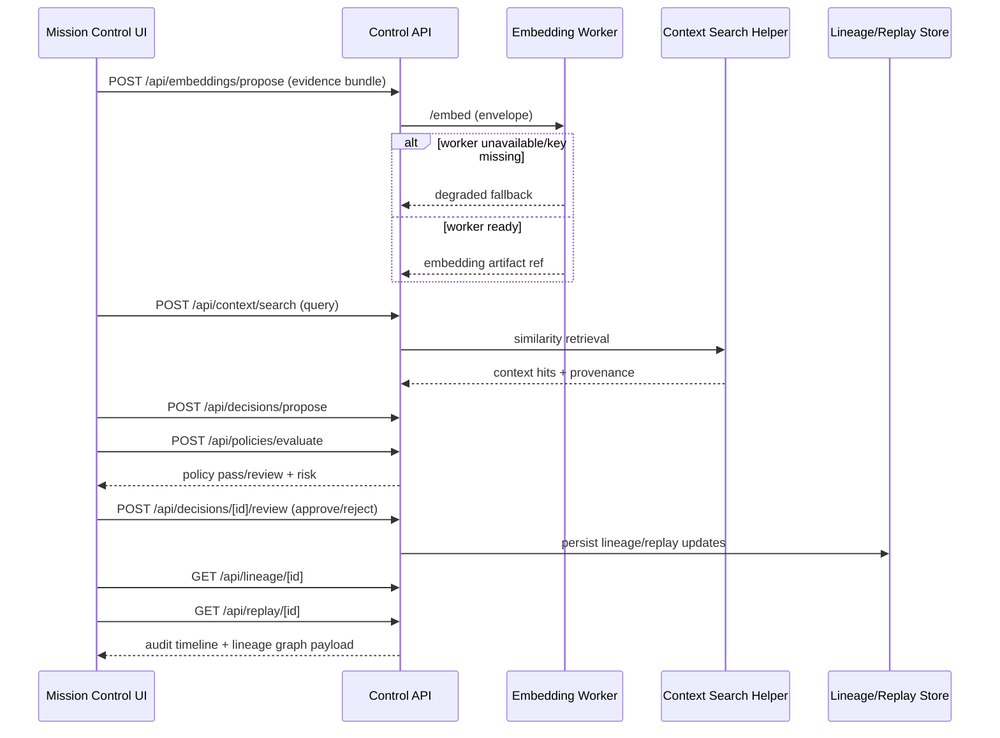

# Budget Reallocation: Minimum Viable ASI Slice

Budget Reallocation is the first end-to-end slice because it naturally exercises policy, approval, lineage, replay, and audit.

## Flow
1. **Evidence Intake (Mission Control UI)**: operator adds text/image/audio evidence.
2. **Embedding/Context Prep (Control API -> Data Plane worker)**: `/api/embeddings/propose` creates embedding job envelope and accepts degraded fallback when worker/key is unavailable.
3. **Context Retrieval (Control API)**: `/api/context/search` runs in-memory similarity search and returns context hits with provenance.
4. **Policy Decision Proposal (Control API)**: `/api/decisions/propose` + `/api/policies/evaluate` produce proposal, policy check, and risk metadata.
5. **Human Gate (Mission Control UI)**: `/api/decisions/[id]/review` handles approve/reject.
6. **Replay/Audit (Trust/Observability view)**: `/api/lineage/[id]` and `/api/replay/[id]` provide traceable artifacts.

## Sequence Diagram

## Guaranteed Artifacts Per Run
- Envelope chain (`proposed` -> `policy` -> `approved/rejected` -> `executed/rejected`).
- Trace continuity across all steps.
- Policy evaluation record with rule hits and risk score.
- Replay token or reference for deterministic reconstruction.
- RFC7807 problem details for any failure stage.

## Non-Goals
- No model serving from UI.
- No direct embedding generation in browser.
- No bypass of policy scope for execution.
