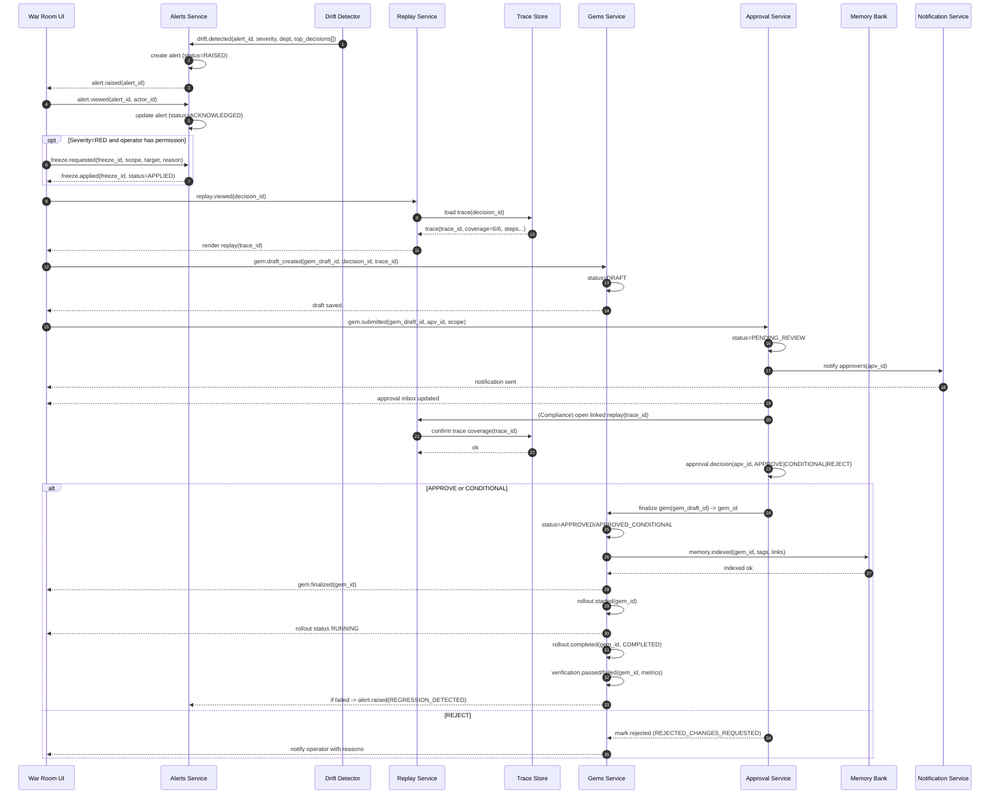

ด้านล่างคือ **ชุดส่งต่อทีม backend/QA ได้ทันที** 2 ส่วนครบชุด:

1. **User Stories + Acceptance Criteria (Operator/Compliance)** (เขียนแบบ testable + Gherkin)
2. **Sequence Diagram (Event IDs + statuses)** + **state machines** + event contract checklist

---

# 1) User Stories + Acceptance Criteria

## Epic E1 — Alert Triage & Containment (War Room)

### US-OP-001: Operator เปิดดู Alert จาก War Room

**As** Operator  
**I want** เปิดดูรายละเอียด alert (drift/violation) จาก War Room  
**So that** สามารถประเมินความเสี่ยงและดำเนินการต่อได้

**Acceptance Criteria**

* **AC1 (Navigation)**: จาก War Room คลิก 🔔 แล้วเห็น Alerts Drawer พร้อมรายการเรียงตามเวลา (ล่าสุดบนสุด)
* **AC2 (Alert Card Fields)**: ทุก alert card ต้องมี `alert_id`, `severity`, `type`, `dept`, `agent(optional)`, `timestamp`, `reason_short`, `resonance_delta`
* **AC3 (Details)**: คลิก alert แล้วเปิด Alert Detail Panel ที่มี:

  * summary + impacted KPI (ถ้ามี)
  * top offending `decision_id[]` อย่างน้อย 1 รายการ (ถ้า type=DRIFT/VIOLATION)
  * suggested actions: `Replay`, `Open Drift Console`, `Freeze Light`
* **AC4 (RBAC)**: ผู้ใช้ที่ไม่มีสิทธิ์ `ALERT_READ` ต้องไม่เห็นเนื้อหาละเอียด (เห็นแค่ “Restricted”)
* **AC5 (Audit)**: การเปิดดู alert detail ต้องสร้าง audit log: `ALERT_VIEWED`

**Gherkin**

```gherkin
Scenario: Operator opens a drift alert detail
  Given I am logged in as OPS_ADMIN
  And I am on War Room
  When I click the Alerts bell
  And I click an alert card
  Then I should see Alert Detail with top offending decisions
  And an audit record "ALERT_VIEWED" should be created with alert_id
```

---

### US-OP-002: Operator ทำ Freeze Light จาก Alert (Containment)

**As** Operator  
**I want** freeze workflow/department/org จาก alert detail  
**So that** ลดความเสียหายก่อนสืบสวน

**Acceptance Criteria**

* **AC1 (Default Scope)**: default scope = `Workflow` (least-disruptive)
* **AC2 (Required Fields)**: ต้องกรอก `scope`, `target`, `reason`; duration optional
* **AC3 (RBAC Guard)**:

  * ถ้า scope=Department/Org ต้องมี permission `FREEZE_DEPT`/`FREEZE_ORG`
  * ถ้าไม่มีสิทธิ์ ให้ปุ่มเป็น `Request Approval` และสร้าง request แทน
* **AC4 (Event + State)**: confirm freeze ต้อง:

  * สร้าง `freeze_action_id`
  * เปลี่ยน state ของ target เป็น `FROZEN`
  * emit event `freeze.applied` หรือ `freeze.approval_requested`
* **AC5 (Visibility)**: War Room event feed ต้องแสดง `FREEZE_APPLIED` ภายใน ≤ 2s

**Gherkin**

```gherkin
Scenario: Operator freezes a workflow from a red alert
  Given I opened an Alert Detail with severity "RED"
  When I click "Freeze Light"
  And I select scope "Workflow" and provide a reason
  And I confirm
  Then the workflow should be marked "FROZEN"
  And event "freeze.applied" should be emitted with freeze_action_id
```

---

## Epic E2 — Replay & Reasoning Trace Audit

### US-OP-003: Operator เปิด Replay จาก Alert Detail

**As** Operator  
**I want** คลิก decision แล้วไป Replay Page ที่โหลด trace ตาม decision_id  
**So that** วิเคราะห์เหตุผลได้ทันที

**Acceptance Criteria**

* **AC1 (Deep Link)**: จาก Alert Detail คลิก decision → route ไป `/replay?decision_id=...&from_alert=...`
* **AC2 (Auto-load)**: Replay ต้องโหลด 6-step trace ภายใน SLA (เช่น p95 ≤ 3s)
* **AC3 (Step Coverage Indicator)**: ต้องมี indicator ว่า trace ครบ 6/6 หรือขาด (พร้อมเหตุผล)
* **AC4 (Redaction)**: ข้อมูล sensitive ต้องถูก redact ตาม role; Compliance เห็นมากกว่า Operator เฉพาะที่ policy อนุญาต
* **AC5 (Audit)**: สร้าง audit `REPLAY_VIEWED` พร้อม `decision_id`

**Gherkin**

```gherkin
Scenario: Replay loads from alert decision link
  Given I am in Alert Detail
  When I click a Decision ID
  Then I should be on Replay page with that decision_id
  And I should see 6-step trace coverage status
  And "REPLAY_VIEWED" audit record should exist
```

---

### US-COM-001: Compliance ตรวจ Reasoning Trace แบบ Mandatory 6 Steps

**As** Compliance Officer  
**I want** ตรวจ trace ครบ 6 steps และ annotate findings  
**So that** รับรองความตรวจสอบย้อนหลังตามมาตรฐาน

**Acceptance Criteria**

* **AC1 (Mandatory Steps)**: UI ต้องบังคับให้ Compliance “เปิดดู” steps ทั้ง 6 อย่างน้อย 1 ครั้ง (tracked) ก่อน approve Gem ที่อ้างอิง decision นี้
* **AC2 (Evidence Links)**: แต่ละ step ต้องมี evidence link(s) (event payload summary, contract results, outcome metrics)
* **AC3 (Annotations)**: Compliance เพิ่ม annotation ผูกกับ `step_id` + timestamp ได้ และ export ได้
* **AC4 (Export)**: export “Evidence Bundle” ได้ทั้ง PDF/JSON พร้อม `trace_id`, `decision_id`, `contract_versions[]`
* **AC5 (Audit)**: สร้าง audit `TRACE_REVIEWED` + `ANNOTATION_ADDED` (ถ้ามี)

---

## Epic E3 — Gem Drafting, Submission, Approval Gate

### US-OP-004: Operator สร้าง Gem Draft จาก Replay (Auto-fill)

**As** Operator  
**I want** กด “Create Gem Draft” จาก Replay เพื่อ auto-fill root cause candidates + patch suggestions  
**So that** ลดเวลาสร้างบทเรียนและทำให้มาตรฐานสม่ำเสมอ

**Acceptance Criteria**

* **AC1 (Auto-fill)**: Gem draft ต้อง auto-populate:

  * title suggestion, linked `decision_id`, linked `alert_id/incident_id` (ถ้ามี)
  * root_cause_candidates[]
  * suggested_patch_types[]
  * default scope = `DEPT` (ยกเว้น agent-specific)
  * attach evidence bundle reference
* **AC2 (Required Fields)**: ก่อน Save Draft ต้องมี:

  * root_cause (เลือก 1)
  * patch details
  * verification metrics
  * rollback plan (mandatory ถ้า scope≠AGENT)
* **AC3 (Status)**: Save Draft → status = `DRAFT`, มี `gem_draft_id`
* **AC4 (Audit)**: `GEM_DRAFT_CREATED`

---

### US-OP-005: Operator ส่ง Gem เข้าคิวอนุมัติ (Submit for Approval)

**As** Operator  
**I want** submit gem draft ไป Compliance Inbox  
**So that** เกิด approval workflow ตาม governance

**Acceptance Criteria**

* **AC1 (Routing Modal)**: submit แล้วต้องเลือก approver group (default=Compliance)
* **AC2 (Dual Approval Guard)**: ถ้า scope=ORG หรือ patch แตะ `PolicyGenome` → ต้องเพิ่ม Executive co-approver และสถานะเป็น `PENDING_DUAL_APPROVAL`
* **AC3 (Immutable Snapshot)**: ตอน submit ระบบต้องเก็บ snapshot ของ:

  * patch content
  * referenced contracts versions
  * replay trace_id
* **AC4 (Event)**: emit `gem.submitted` พร้อม `gem_draft_id`, `scope`, `approval_mode`
* **AC5 (Notifications)**: ส่ง notification ไป approver ภายใน ≤ 10s

---

### US-COM-002: Compliance อนุมัติ/อนุมัติแบบมีเงื่อนไข/ปฏิเสธ Gem

**As** Compliance Officer  
**I want** review gem + approve/conditional/reject  
**So that** บทเรียนที่เข้าระบบต้องปลอดภัยและตรวจสอบได้

**Acceptance Criteria**

* **AC1 (Linked Replay Mandatory)**: ก่อนกด Approve ต้องเปิด linked replay และ trace coverage ต้อง ≥ policy threshold (เช่น 6/6 สำหรับ SEV-1/2)
* **AC2 (Decision Options)**:

  * Approve
  * Approve with Conditions (เช่น staging soak 7 วัน, canary 10%, extra contract check)
  * Reject (ต้องใส่เหตุผล + required changes)
* **AC3 (State Transitions)**:

  * Approve → `APPROVED`
  * Conditional → `APPROVED_CONDITIONAL`
  * Reject → `REJECTED_CHANGES_REQUESTED`
* **AC4 (Event)**: emit `approval.decision` พร้อม `decision=APPROVE|CONDITIONAL|REJECT`
* **AC5 (Audit)**: `GEM_REVIEWED`, `GEM_APPROVED`/`GEM_REJECTED`

---

## Epic E4 — Rollout, Verification, Knowledge Registration

### US-OP-006: Operator ติดตาม Rollout และ Verification ของ Gem

**As** Operator  
**I want** ดูสถานะ rollout + metrics verification และ rollback ได้  
**So that** มั่นใจว่า patch ไม่ทำให้เกิด regression

**Acceptance Criteria**

* **AC1 (Rollout Status)**: ต้องมีสถานะ `QUEUED → RUNNING → COMPLETED/FAILED`
* **AC2 (Verification Metrics)**: แสดง metrics ที่ตั้งไว้ใน gem draft และคำนวณอัตโนมัติ
* **AC3 (Rollback)**: ถ้าตรวจพบ regression → แสดงปุ่ม rollback ตาม permission `ROLLBACK_PATCH`
* **AC4 (War Room Feedback Loop)**: หาก verification fail → สร้าง alert `REGRESSION_DETECTED`
* **AC5 (Audit)**: `ROLLOUT_STARTED`, `ROLLOUT_COMPLETED`, `VERIFICATION_PASSED/FAILED`

---

### US-COM-003: Knowledge Base Registration ต้องมี “Done Criteria”

**As** Compliance Officer  
**I want** มั่นใจว่า gem ที่ approve ถูก register เข้า Memory Bank พร้อม index/links  
**So that** องค์กร “ไม่ผิดซ้ำ” ตามหลัก ASI

**Acceptance Criteria**

* **AC1 (Registration Panel)**: แสดง 3 checkmarks:

  * Indexed ✅ (tags, embeddings/index)
  * Linked ✅ (intent/contract/incident/decision)
  * Propagated ✅ (applied scope at least staging)
* **AC2 (Searchability)**: ภายใน SLA (เช่น ≤ 1 นาทีหลัง approved) gem ต้องค้นหาได้จาก Global Search ด้วย `gem_id` และ keyword title
* **AC3 (Immutability)**: Gem final (`GEM-####`) ต้อง immutable; แก้ไขได้ผ่าน “superseding gem” เท่านั้น
* **AC4 (Audit)**: `MEMORY_INDEXED`

---

# 2) Sequence Diagram (Event IDs + Statuses) สำหรับ Backend/QA

## 2.1 ID Conventions (แนะนำให้ทีมยึด)

* `ALR-YYYYMMDD-XXXX` = Alert ID
* `DEC-<ULID>` = Decision ID
* `TRC-<ULID>` = Trace ID
* `FRZ-<ULID>` = Freeze action ID
* `GEMD-<ULID>` = Gem Draft ID
* `GEM-<ULID>` = Gem Final ID
* `APV-<ULID>` = Approval request ID
* `INC-<ULID>` = Incident ID

> ทุก event ควรมี `correlation_id`, `causation_id`, `actor_id`, `actor_role`, `env`, `timestamp`

---

## 2.2 Status Models (State Machines)

### Alert Status

* `RAISED → ACKNOWLEDGED → RESOLVED` (optional: `SUPPRESSED`)
* severity: `YELLOW | ORANGE | RED`
* type: `DRIFT | CONTRACT_VIOLATION | SLA_BREACH | COST_SPIKE`

### Freeze Status

* `REQUESTED → APPLIED → RELEASED`
* alt: `REQUESTED → APPROVAL_PENDING → APPLIED/REJECTED`

### Gem Draft Status

* `DRAFT → PENDING_REVIEW → (APPROVED | APPROVED_CONDITIONAL | REJECTED_CHANGES_REQUESTED)`

### Rollout Status

* `QUEUED → RUNNING → COMPLETED | FAILED | ROLLED_BACK`

### Verification Status

* `PENDING → PASSED | FAILED`

---

## 2.3 Event Catalog (ขั้นต่ำที่ QA ต้องเห็น)

| Event Name                   | When                   | Key Fields                                       |
| ---------------------------- | ---------------------- | ------------------------------------------------ |
| `drift.detected`             | drift engine detects   | alert_id, severity, dept, resonance_score, delta |
| `alert.raised`               | alert created          | alert_id, type, top_decisions[]                  |
| `alert.viewed`               | user opens detail      | alert_id, actor_id                               |
| `freeze.requested`           | user requests freeze   | freeze_id, scope, target, reason                 |
| `freeze.applied`             | freeze active          | freeze_id, applied_at                            |
| `replay.viewed`              | replay opened          | decision_id, trace_id, coverage                  |
| `trace.reviewed`             | compliance step review | trace_id, steps_viewed[]                         |
| `gem.draft_created`          | create gem draft       | gem_draft_id, decision_id                        |
| `gem.submitted`              | submit approval        | gem_draft_id, apv_id, scope                      |
| `approval.decision`          | approve/reject         | apv_id, decision, conditions[]                   |
| `gem.finalized`              | gem becomes final      | gem_id, gem_draft_id                             |
| `rollout.started`            | rollout begins         | gem_id, targets                                  |
| `rollout.completed`          | rollout ends           | gem_id, result                                   |
| `verification.failed/passed` | metrics evaluated      | gem_id, metrics                                  |
| `memory.indexed`             | KB register done       | gem_id, index_refs                               |

---

## 2.4 Sequence Diagram (Mermaid)



---

# 3) QA Test Matrix (สรุปสั้น ๆ ให้ทีมทดสอบ)

## Core Paths

* P1: DRIFT RED → Freeze applied → Replay → Gem draft → Submit → Approve → Indexed → Rollout → Verification pass
* P2: DRIFT RED → Operator lacks permission → Freeze approval requested (no applied) → Replay continues
* P3: Replay trace incomplete (coverage < 6/6) → Gem submission blocked for SEV-1 (policy) + request trace reconstruction
* P4: Org-wide gem → dual approval required → no finalize until both approvals
* P5: Conditional approval → staging soak enforced → production rollout disabled until condition met
* P6: Verification fail → regression alert created + rollback available (permissioned)

## Non-functional (ขั้นต่ำ)

* War Room alert appears ≤ 2s after drift.detected
* Replay load p95 ≤ 3s
* Approval notification ≤ 10s
* Memory index searchable ≤ 60s after approve

---
