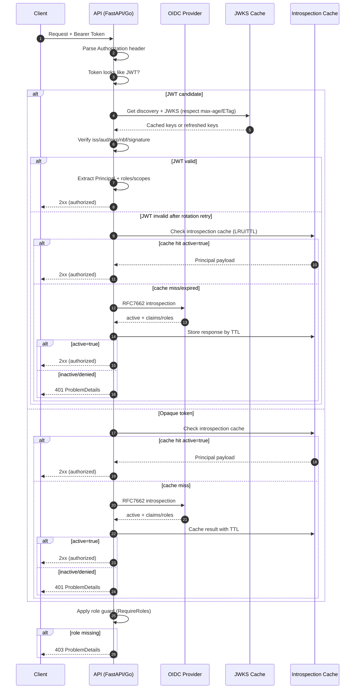

# OIDC/JWT + Introspection Fallback Sequence

เอกสารนี้สรุปลำดับการตรวจสอบสิทธิ์สำหรับ API scaffold ทั้งฝั่ง **FastAPI** และ **Go** ตามการตั้งค่า OIDC verifier ปัจจุบัน
(ตรวจสอบ JWT ก่อน และ fallback ไป introspection เมื่อโทเค็นเป็น opaque หรือยืนยันลายเซ็นไม่ได้หลัง retry ตามนโยบาย)

## หมายเหตุการใช้งาน

- ควรกำหนดเวลาแคชจาก `Cache-Control` ของ discovery/JWKS และรองรับ `ETag` เพื่อลดปริมาณทราฟฟิกไปยัง IdP
- introspection cache ควรใช้ TTL ตาม `exp` ของ token (ถ้ามี) หรือ fallback TTL จาก config
- ควรคืน error ตามรูปแบบ ProblemDetails/RFC7807 ให้สอดคล้องกันทุก service
